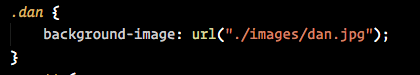
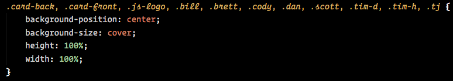

Instructions - Flip One Card
--

### Overview

In this feature:
  - You are adding the functionality that will reveal the image on one card once it is clicked.

  - After you have completed this initial functionality:
    - You must add a second card and confirm that clicking on either card reveals the image on only the card that is clicked.
    - The reason for this test is that most initial attempts to flip the card will flip both cards once a second card is added.
    - **This functionality must be properly completed prior to moving on to the next feature set.**

### Feature Set

1. In the head of your `index.html`, add the jQuery CDN below
   - ``
2. Then add a second `<script>` tag in your `index.html` file **BENEATH** the script tag for jQuery, and set its src to the included `script.js` file.
    - This is to ensure that you load jQuery prior to your own JavaScript file
3. Alter the HTML for this Feature Set.
    - Begin by commenting out all of your card divs except the first one.
    - On that first card div that you did not comment out:
      - Add the "lfz-card" image to the first child div as a background image.
      - Add an instructor image to the second child div as a background image.
        - It is recommended that you add the instructor and card images as background images by using individual classes which contain the url for the card or individual instructors.
          - **For Example:**
            - 
            - This way, you can have the CSS for the child div that you want to place the background image on separate from the image itself, and just add the class for the individual instructor you want.
            - **For Example**
              - The grouped selector and CSS you use for the card fronts and backs could be: 
              - This would properly size all of the cards, give them the properties you need for the background images to show, and allow you to change the images by just adding or changing the instructor class!
                - **NOTE** your classes may differ in name, this is only an example of one way to do it.
4. Now that the HTML is prepared, use jQuery to select your single card.
    - First use the jQuery `$(document).ready()` function to call an `initializeApp` function
      - Declare `$(document).ready()` at the top of the file and pass in `intializeApp` as a callback so that it is called after the HTML loads
      - **NOTE:** You are doing this because elements must exist on the page before you can attach event handlers to them
    - Now declare an `intializeApp` function
      - The function will take no parameters
      - Within the `intializeApp` function:
          - apply a click handler to the card you did not comment out
            - documentation: https://www.w3schools.com/jquery/event_on.asp
            - documentation:
            https://api.jquery.com/on/

    - This click handler will take a callback function called `handleCardClick`.
      - This callback will be called when the click event occurs
5. Next, declare a new function in the global space, `handleCardClick`
    - This function will take a single parameter:
      - The parameter will be named `event`
      - It will contain the `event` object that is passed forward by your click handler.
        - The `event` object will contain the information you need to target specific cards.
          - It is recommended that you console log out the `event` object and look for the `currentTarget` property.
            - When using click events, the jQuery event object will store the reference to the clicked element in the `currentTarget` property
    - Initially, this function only needs to hide the first child div of the card you have clicked on.
      - To hide the card, we are going to use a CSS class that is either added or removed:
        - Create a CSS class selector in your CSS file called `.hidden`.
          - This selector must be placed at the bottom of the CSS document to ensure it will always apply!
        - In the selector, add `display: none;`
        - Use jQuery to select the first child div of the card you clicked on.
          - Remember, that is where you added the "lfz-card" image as a background image!
          - Also remember that you can target the element that was clicked on by using `$(event.currentTarget)`
          - You will need to add to this selector to get the first child
            - Documentation: https://www.w3schools.com/jquery/jquery_selectors.asp
            - Documentation: https://www.w3schools.com/jquery/traversing_find.asp
        - Once you have properly selected the element you want to hide:
            - Use jQuery to add the `hidden` class to the element you selected
      - Once the first child is hidden, the background image of the instructor you added to the second child should be revealed.

6. After you achieve "flipping the card":
    - Uncomment the next card.
    - Add the background images as you did for the first card.
    - Make sure that clicking on the cards flips only the card you clicked on.
      - If you are having difficulties, that is ok
        - check the documentation
        - reach out to an instructor!

### Design Docs

#### Flip One Card

### After Each Feature

- When your feature implementation is complete, you will want to save and submit your work to the branch that you have created.
  - Use `git status` to check that you are on the correct branch that represents your feature.
  - You will want to **add**, **commit**, and **push** the code that you have written to the appropriate Github repository.
    1. `git add .`
    2. `git commit -m "Description of the feature that you have implemented"`
       - e.g. `git commit -m "Added simple HTML skeleton"`
    3. `git push origin FEATURE_NAME_HERE`
       - e.g. `git push origin skeleton`

- Finally, you will want to create a pull request. This will merge the code from your newly **completed** feature branch into your `master` branch.

  1. Navigate to <kbd>New Pull Request</kbd>:
  
  2. Compare changes to merge:
  
  3. Create a new pull request:
  
  4. Merge pull request:
  
  5. Update master with the new changes:
  
  6. Go back to [Features](../../README.md#features), if you're still working through the project.
