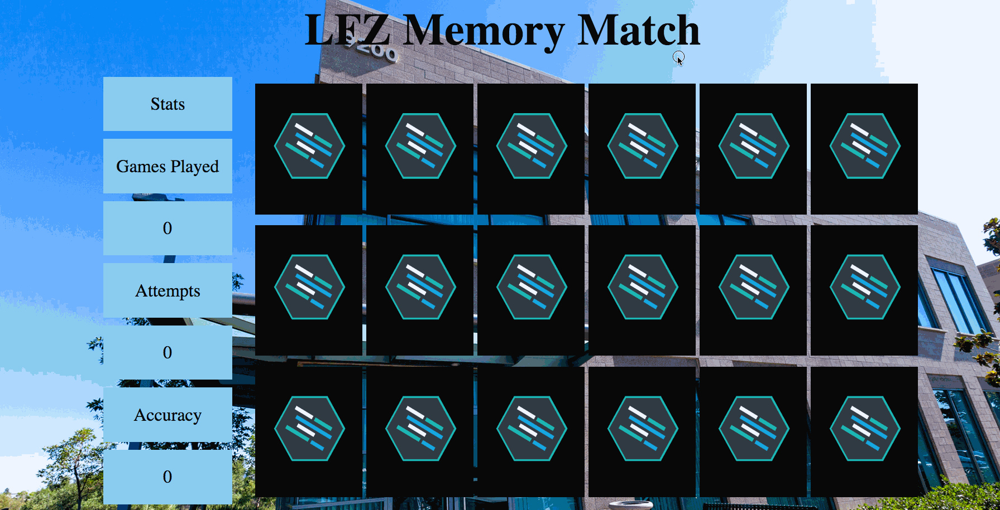
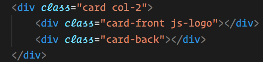
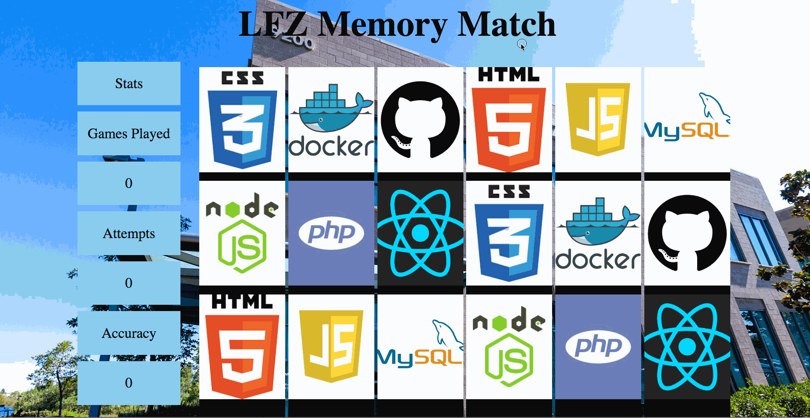
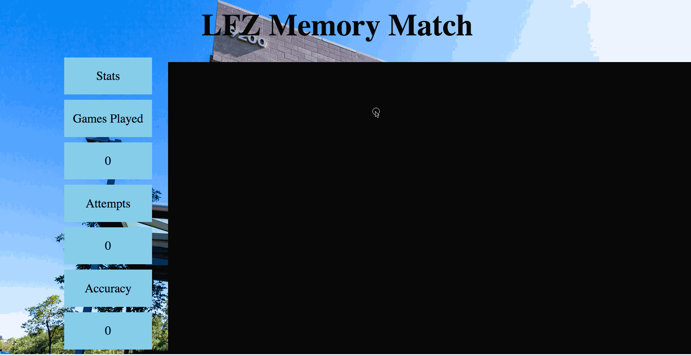
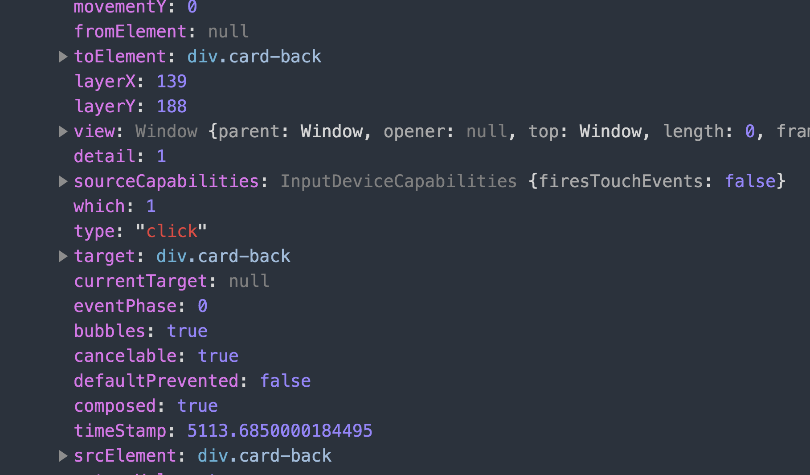
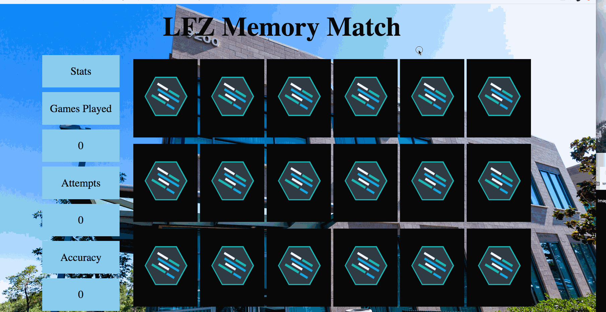
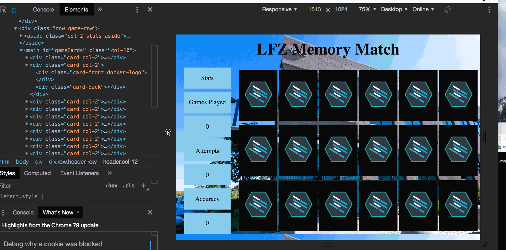
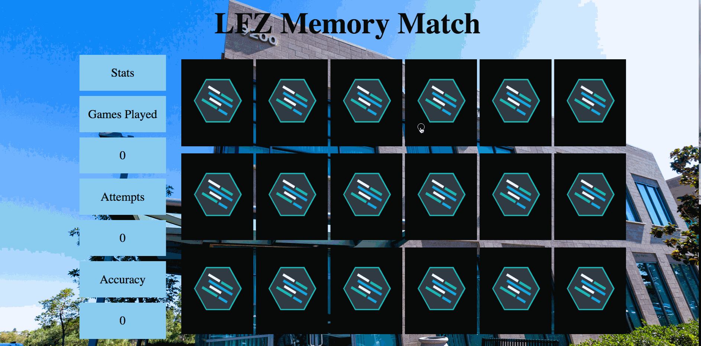

Instructions - User Can Flip Cards
--

### Overview

In this feature:
  - You are updating the HTML and CSS to include the `front` and `back` card images which will be used for the matching game, and adding the necessary JavaScript to hide the `back` of a card which is clicked.

  Let's look at a list of steps which must be accomplished for the Feature.

  1. Adding additional HTML to create the `front` and `back`  cards.
  2. Adding additional CSS to for the new `front` and `back` background images, and necessary `positioning` changes.
  3. Adding click functionality to the cards.
  4. Creating a CSS class which will be used to hide the `back` of the cards when they are clicked.
  5. Click functionality which will use the CSS from the previous step to hide the `back` of the card and reveal the `front` of the card that is clicked.

  Now let's look at the design doc again:
  

  With the design in mind, let's look at the steps above in order:


  ## 1. Adding additional HTML to create the `front` and `back`  cards.

  - The magic of making cards disappear when they are clicked will require some modifications to the initial build of the current HTML structure.
  - Because the desired effect is to click on the `back` of a card and reveal its `front`, the current divs being used to represent the card will require some child divs.
    - The reason for this, is that if you were to click on one of the current divs and hide it, the layout would break! Look at this example:
    
      - This is because each card is taking up space on the DOM and is part of the document flow, so if an element is removed, the surrounding elements re-orient themselves to the updated document flow.
    - To solve this problem, we will create 2 child elements for the `card` element which will be used to contain the `card-back` and `card-front` images.
      - Update your `card` elements as shown:
      ```HTML
        <div class="col-2 card">
          <div class="card-front"></div>
          <div class="card-back"></div>
        </div>
      ```
    - When the HTML for all 18 cards have been updated, it is time to update the CSS!
  - Move on to the next step!

  ## 2. Adding background-images, and necessary `positioning` changes to the `front` and `back` cards.

  - Now that your HTML structure has been updated, it is time to add background images to the new cards!
    - The first step to this is to create a group selector for the two cards. Much of the CSS they require is identical, and it is always advised to group identical CSS properties.
      - In your CSS file, create the following selector:
      ``` css
      .card-front, .card-back {

      }
      ```
      - Within the code block for the selector, add the following CSS:
        - height: 100%;
        - width: 100%;
          - The above two properties will ensure that both the `front` and `back` cards are the same size as their `card` parent.
            - This does assume that you set height on the `card` element for the previous Feature Set!
        - background-size: cover;
          - This will ensure that the image covers the entire div, and will trim the image as needed to maintain the original aspect ratio.
        - background-repeat: no-repeat;
          - this will prevent the background image from repeating to fill the element.
        - background-position: center;
          - this will center the background image in the element, so that what is trimmed off from background size cover will be even on all sides
      - Now that the `front-card` and `back-card` have all of the CSS needed for size and to prepare for background-images, it is time to add the background images themselves!
        - The recommended way to do this is to create a class for each background image you want to use in the game. For Example:
        ``` css
        .card-back {
          background-image: url(./images/lfz-card.jpg)
        }
        .js-logo {
          background-image: url(./images/js-logo.png)
        }
        ```
        - This makes it very easy to add or change background images simply by changing a class:
        

      - Based on the example above do the following:
        - Create a CSS class for each of the 9 Tech logo images
        - Add the classes to the `card-front` element so that 2 of each class are used for a total of 9 matching classes.
      - When this is complete, run the code, it should look something like this:
      
      I'm sure you notice that there is a big overflow problem! The reason for this is that all of the cards are in the flow of the document, so they are all fighting for space! To fix this, we are going to alter the position property for the `card` element, and for the `card-back` and `card-front` elements.
      - First, add `position: absolute` to the selector for the `card-back` and `card-front` elements, then refresh the page.
        - Your output should look something like this:
        
        What happened???
        - What happened is that because you added `position:absolute` to the `card-back` and `card-front` elements, those elements are now positioning themselves against their closest ancestor with a non-static `position` value.
        - In the above example, there are no ancestors to those elements who have a `position` other than static, so the elements position themselves against the body.
          - That also means they are now taking their `height` and `width` from their parents...
          - So, because their height and width is set to 100%, both elements are taking the full size of the body!
        - To fix this, you just have to add `position-relative` to the parent of the `card-back` and `card-front` elements. Do this and refresh the page!
        - The new output should be like this:
        
        Because you added a non-static position property to the parent of the `card-back` and `card-front` elements, they will once again position and size themselves to their parent!
      - When the above is complete, and your output looks correct, move on to the next step!
        - If you are still having problems, please reach out for assistance before moving on!
## 3. Adding click functionality to the cards.

  - Now that your HTML and CSS are prepared for click functionality, it is time to add JavaScript!
    - Within the `index.html` file, do the following:
      - Add an id to the `main` element named `gameCards`
    - Now open the `main.js` file and do the following:
      - Attach a click event listener to the element with the `id` of `gameCards`
        - Give it a callback function named `handleClick`
      - Now declare the `handleClick` function with a single parameter, `event`.
        - Within the `handleClick` function, console log the `event` parameter.
    - Refresh the app, open the inspector,  and click on one of the cards:
      - Confirm that you received a console log of the mouse event.
        - If you did not, check your code for errors.
          - Make sure you did not forget to add a script tag to the `index.html` page which has `main.js` as its source!
      - Check the `target` property of the `event` object, what element is stored at that property?
      
        - Note that placing the event listener on the parent element of the `card` elements allows the `click` events to `bubble` up.
      - So the `target` property stores a reference to the individual element on which the `event` took place.
        - This information will be very useful for hiding the `card-back` elements!
    - With `click` functionality established on the cards, move on to the next step!

## 4. Creating a CSS class which will be used to hide the `back` of the cards when they are clicked.
  - Now that you are able to click on the `cards`, we are going to add some CSS which will make it easy to hide the card!
  - Within the `style.css` file do the following:
    - Create a new class selector at the very bottom of the file:
    ``` css
    .hidden {

    }
    ```
    `Note:` It is placed at the bottom of the CSS so that it cannot be overridden by `cascading`!
    - Within the new selector, add `display: none`
    - Now you have a `hidden` class which will hide any element you add it to!
    - When this is complete, move on to the next step!

## 5. Adding additional click functionality which will use the CSS from the previous step to hide the `back` of the card and reveal the `front` of whatever card is clicked.

- So now that you have a CSS `hidden` class available to hide elements, it is time to use it!
  - Remember that in step 3, the `target` property of the `event` object held a reference to whatever element was clicked on:
  
  - So to hide the element which was clicked on, we need to add the `hidden` class to the element whose reference is stored on the `event.target` property.
  - Within the `handleClick` function, do the following:
    - Select the element which is stored at the `target` property of the `event` parameter and add the hidden class to the element which was clicked on.
      - This documentation on the `className` property will be helpful in adding the class. [**Click Here**](https://www.w3schools.com/jsref/prop_html_classname.asp)
      - Make sure you don't overwrite any existing class names! You want to add the hidden class in addition to the current class names on the element.
    - When you have completed the above, test the app by refreshing it and clicking on a couple of the cards:
      - Working Example:
      
      - If your cards are not flipping, check your code to confirm you are properly adding the class.
        - Highlighting the element in the inspector and confirming the class is added is advisable too:
        
      - Confirm that your cards are being hidden before moving on!
  - The cards are flipping! But, there is one more thing that must be done before moving on to the next Feature Set. Try clicking on the `main` element itself instead of one of the cards... What happens?
    - You should notice this behavior:
    
    - So what happened?
      - The problem is that you have an event listener on the `main` element which is listening for any events on its children, (because events bubble up) but also on it self.
      - So when you click on the `main` element, your `handleClick` function is adding the hidden class to it and POOF the `main` element and all its children are hidden!
      - To fix this, we have to add a conditional check to the top of the `handleClick` function which confirms that we are clicking on one of the `card-backs` before hiding the element.
  - Do the following within the `handleClick` function:
    - Create a conditional `if` statement at the top of the function.
    - Open this documentation on the `indexOf()` method [**here**](https://developer.mozilla.org/en-US/docs/Web/JavaScript/Reference/Global_Objects/String/indexOf)
    - Now, to confirm that one of the `card-back` cards was clicked on, we are going to check the `className` property of the element which was clicked on and confirm that it contains the class `card-back`.
    - Note the following line of JS:
    ```javascript
    if(event.target.className.indexOf("card-back") === -1) {
      return;
    }
    ```
    - Let's breakdown the above:
      - We are targeting the `className` property of the element which was clicked on.
      - We are calling the `indexOf()` method on the string that is returned from the `className` property, and passing it `"card-back"` as an argument.
        - The `indexOf()` method will search the string for that collection of characters, and return the index of where those characters exist in the string.
        - The `indexOf()` method will return `-1` if those characters do not exist in the string.
      - So, if the element which was clicked on does not have a class of `card-back`, `indexOf()` will return `-1` the expression will be true, and the code will `return` out of the function!
        - Preventing functions from running is this way to prevent undesired effects is common in programming, so make sure you have a conceptual understanding of it before moving on.
        - Also, read the documentation on the `indexOf()` method. It is very important to understand how the method works!
  - So now that you understand the above conditional check, add it to your `handleClick` function and test it!
  - When you can no longer hide any elements but the cards when they are clicked, Congratulations! You have completed functionality for flipping the cards!
  - Move on to the `After Each Feature` section!

### After Each Feature

- When your feature implementation is complete, you will want to save and submit your work to the branch that you have created.
  - Use `git status` to check that you are on the correct branch that represents your feature.
  - You will want to **add**, **commit**, and **push** the code that you have written to the appropriate Github repository.
    1. `git add .`
    2. `git commit -m "Description of the feature that you have implemented"`
       - e.g. `git commit -m "Added simple HTML skeleton"`
    3. `git push origin FEATURE_NAME_HERE`
       - e.g. `git push origin skeleton`

- Finally, you will want to create a pull request. This will merge the code from your newly **completed** feature branch into your `master` branch.

  1. Navigate to <kbd>New Pull Request</kbd>:
  
  2. Compare changes to merge:
  
  3. Create a new pull request:
  
  4. Merge pull request:
  
  5. Update master with the new changes:
  
  6. Go back to [Features](../../README.md#features), if you're still working through the project.
