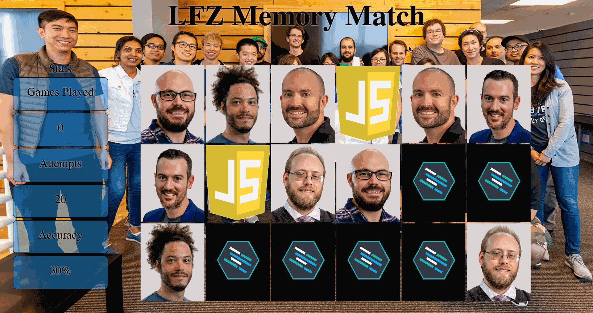

Instructions - Resetting Game
--

### Overview

In this feature, you are resetting the game.
  - To do this you must:
    - Reset the stats to their original values
      - Except for `games played`, that must be incremented everytime the game is reset
    - Return the cards to their original state
      - This means all instructor cards are hidden and the `lfz-card` images are shown

### Feature Set

1. In your `script.js` file, declare a function, `resetStats`.
2. The function should reassign all the variables used to track stats back to `null`.
   - `matches`
   - `attempts`
3. Resetting the game counts as completing the game.
   - Increment the `games_played` variable, by `1`.
4. Use your previously created function, `displayStats`, to update the DOM for the recently modified stat variables.
5. Additionally, select all the cards that are on the page and flip them back.
    - The `lfz-card` images should be showing.
    - You will want to remove the `hidden` class on all cards to set them back to their original states before the game has been played.

### Design Docs

#### Game Reset

### After Each Feature

- When your feature implementation is complete, you will want to save and submit your work to the branch that you have created.
  - Use `git status` to check that you are on the correct branch that represents your feature.
  - You will want to **add**, **commit**, and **push** the code that you have written to the appropriate Github repository.
    1. `git add .`
    2. `git commit -m "Description of the feature that you have implemented"`
       - e.g. `git commit -m "Added simple HTML skeleton"`
    3. `git push origin FEATURE_NAME_HERE`
       - e.g. `git push origin skeleton`

- Finally, you will want to create a pull request. This will merge the code from your newly **completed** feature branch into your `master` branch.

  1. Navigate to <kbd>New Pull Request</kbd>:
  
  2. Compare changes to merge:
  
  3. Create a new pull request:
  
  4. Merge pull request:
  
  5. Update master with the new changes:
  
  6. Go back to [Features](../../README.md#features), if you're still working through the project.
