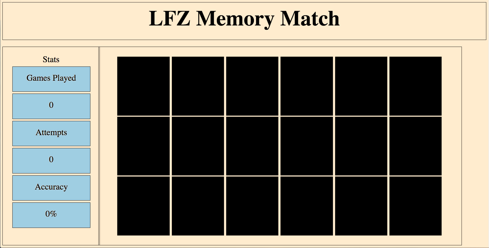
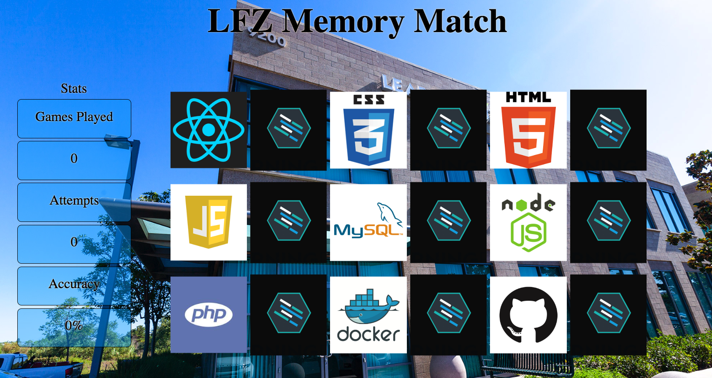

Instructions - Skeleton
--

### Overview

In this feature, you are going to use HTML and CSS to create and initially style the skeleton of your Memory Match application.

Here is an example of the initial skeleton

#### Initial Build

## Notice that the page is divided into 3 sections:
  - A `<header>` element, which will be used for a heading and/or logo.
  - An `<aside>` element, which will be used to hold data / information regarding game stats.
  - a `<main>` element, which will be used to hold the cards to play through your Memory Match game.

## Things to consider about the skeletal structure
  - It is recommended to use a simple `grid` structure for the overall layout.
    - Start with a `container` element which will hold the 3 primary elements
    - Now consider how two rows could be used for the layout:
      - One row for the `header`
      - One row for the `aside` and the `main`
    - Now think about `columns`
      - The `header` appears to use all available columns.
      - The `aside` appears to use about 1 / 5 of the total width.
      - The `main` appears to use the remaining 4 / 5s of the total width.
      - So perhaps using 5 total columns would be useful...?
  - Once you have completed planning the grid layout, let's look at the child elements contained within the 3 primary elements:
  

- In a `style.css` file, include the CSS properties to get a rough match of the provided design doc.
  - Keep in mind that the initial build will be for a static page.
  - It will be refactored into full responsiveness prior to inclusion in your portfolio, but:
    - You do not have the time for a responsive build at this point.
    - Focus on learning how to position elements on the page.
    - Float and Flexbox are both useful for building the layout.
      - Create classes on the elements you want to apply CSS to, use those classes for CSS selection.
        - Do not use ids for styling, ids are for JavaScript selection.
      - Use borders / background colors to ease the viewing of the elements you want to position on the page.
      - Use the styles feature of the Chrome Inspector to make changes in real time.
  - And Lastly, CSS is hard! Make sure to ask questions and keep at it!

### Design Docs

#### Final Design with all assests

#### With cards flipped to show images

### After Each Feature

- When your feature implementation is complete, you will want to save and submit your work to the branch that you have created.
  - Use `git status` to check that you are on the correct branch that represents your feature.
  - You will want to **add**, **commit**, and **push** the code that you have written to the appropriate Github repository.
    1. `git add .`
    2. `git commit -m "Description of the feature that you have implemented"`
       - e.g. `git commit -m "Added simple HTML skeleton"`
    3. `git push origin FEATURE_NAME_HERE`
       - e.g. `git push origin skeleton`

- Finally, you will want to create a pull request. This will merge the code from your newly **completed** feature branch into your `master` branch.

  1. Navigate to <kbd>New Pull Request</kbd>:
  
  2. Compare changes to merge:
  
  3. Create a new pull request:
  
  4. Merge pull request:
  
  5. Update master with the new changes:
  
  6. Go back to [Features](../../README.md#features), if you're still working through the project.
