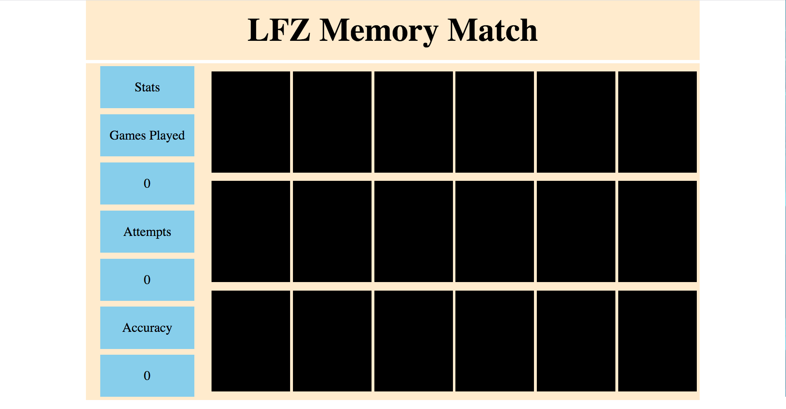
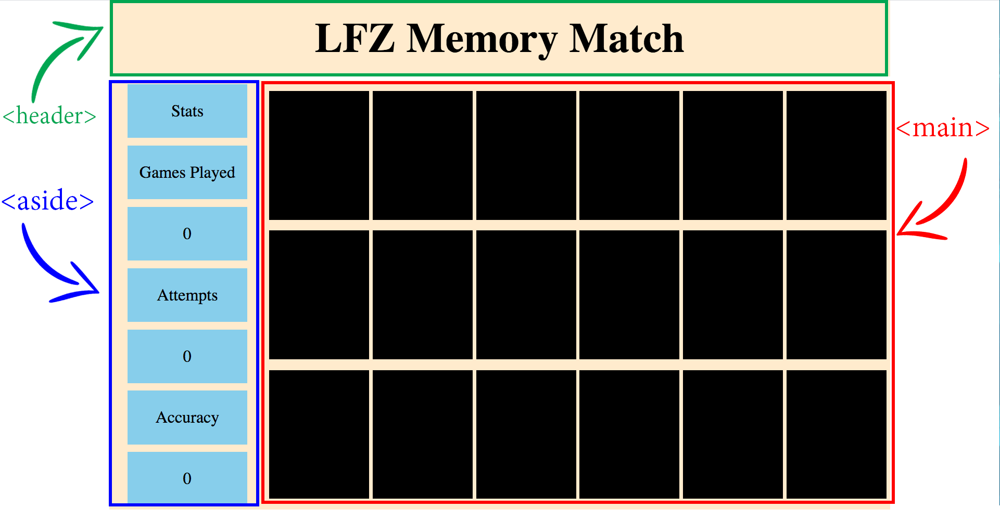
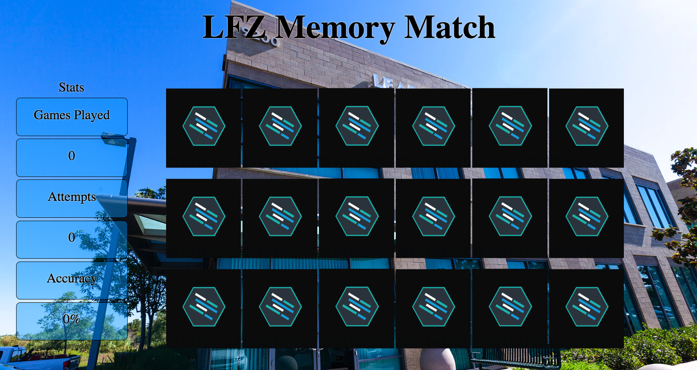
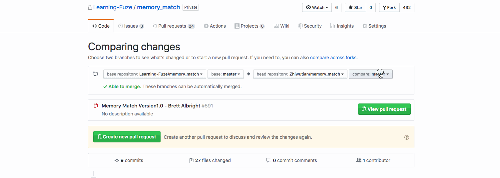

Instructions - User Can View Game
--

### Overview

In this feature, you are going to set up the project and complete all the work necessary to view the Memory Match game.

Let's look at a list of steps which much be accomplished for the Feature.

1. Design a simple grid system for use in constructing the layout.
2. Identify what primary elements you will need to divide the page correctly.
3. Identify the child elements you will need in each of the primary elements.
4. Build the initial HTML skeleton based on the required element list.
5. Implement the correct CSS to style the skeleton based on the Design Doc


Here is an example of the initial skeleton:

#### Initial Build


Now that you the basic layout of what you have to build, let's take a look at the steps above in order:

## 1. Design a simple grid system for use in constructing the layout.

  - First let's remember the components of a grid system:
    - A Container
      - Which is a fixed size container that holds the rows and columns of the layout.
    - A Row
      - Which is a horizontal collection of elements which span the width of the container.
    - A Column
      - Which is a unit of space on the x axis that determines the width of individual elements in a row.
  - Now, let's look at the Design Doc again and consider how to break the layout down into a simple grid:
    - Notice that there is are two rows of content:
      - A header which takes up the entire width of the page
      - And two Elements which hold Stats information and the Game cards
    - This means the layout can be broken down into:
      - A single `Container`
      - With two `Rows`

    - With that information in hand, it is time to decide on columns.
  - Most popular third party grid systems such as BootStrap and Materialize use a 12 column grid system, so that will be a great place to start.
    - If we take 100% and divide it by 12, that gives us approximately 8.33% per column. So let's use 8% to give us a little room to manuever
      - The reason for this slight reduction in column size is that Bootstrap and other grid libraries use a lot of additional CSS for Margin, Padding, and few other things to allow their system to use a truly 100% wide - 12 column setup.
      - But for the purposes of this application, a slight reduction in column size will have a negligible affect, and will vastly simplify the creation of the grid system you are using.
  - Now that we have decided on a 12 column grid system with 8% wide columns, let's construct the CSS classes for the grid!
    - Create a new grid.css file as a sibling to the current style.css file. In that file, create the following classes:
      - Create a class named `container` with the following CSS:
        - width: 100%
        - max-width: 1500px
        - margin: auto
        - The above CSS will create a container which is centered on screens which are wider than 1500px and takes up 100% of the width on screens less than 1500px wide.
      - Next create a class named `row` with the following CSS:
        - width: 100%
        - display: flex
        - margin-bottom: .5rem
        - The above CSS will create a row which is 100% of the width of the container, creates a little space between rows, and is prepared to use `flexbox` properties on its children.
      - Finally, create the 12 column classes with width set to increments of 8%. For example:
        ``` css
          .col-1 {
            width: 8%;
          }
          .col-2 {
            width: 16%;
          }
          .col-3 {
            width: 24%;
          }
        ```
          - Make sure to create all 12 classes!
  - With the CSS for our custom grid complete, it's time to move on to the next step!

  ## 2. Identify what primary elements you will need to divide the page correctly.

  - Looking at the Design Doc again:
    
    We notice that there are 3 Primary elements in the layout:
    - A `<header>` element, which will be used for a heading and/or logo.
    - An `<aside>` element, which will be used to hold data / information regarding game stats.
    - a `<main>` element, which will be used to hold the cards to play through your Memory Match game.
  - Most layouts can be broken down into only a few primary elements just as this one can be. So with the knowledge of the three elements we need. Let's move on to the next step!

  ## 3. Identify the child elements you will need in each of the primary elements.

  - Looking at the Design Doc once again:
    
    Let's evaluate which child elements are needed in each of the primary elements:
      - `<header>`
        - child elements:
          - There is a single line of text
            - This requires a single text element.
      - `<aside>`
        - child elements:
          - There are 7 boxes within the `aside` element, and each of the boxes contains text
            - This requires 7 divs, and each div will have a text element as a child.
      - `<main>`
        - child elements:
          - There are 18 boxes within the `main` element
            - This requires a minimum of 18 divs.
      - `Note:` Some of the above element amounts may increase or otherwise change as you continue to build the game, but these are the correct number to start with at this stage of planning!
      - With our child elements determined, move on to the next step!

  ## 4. Build the initial HTML skeleton based on the required element list.

  - Now it is time to build the initial HTML structure for the Memory Match game:
    - Using the list of required elements from steps 2 and 3, create your HTML skeleton in the `index.html` file.
      - Remember that some elements you may initially choose could be replaced, but the most important thing is to create a skeleton based on the available information!
    - Don't forget your grid elements!
      - You must properly use elements for your `container` and `rows`
      - Example, the `header` element must be contained within a `row` element because the `header` fills one of the 2 rows:
        ``` HTML
        <div class="row">
          <header></header>
        </div>
        ```
      - This documentation on Bootstrap 4 will be useful for seeing examples of HTML structures for Grid systems. [**Click Here**](https://getbootstrap.com/docs/4.0/layout/grid/)
    - After you have completed your initial HTML, move on to the next step!

  ## 5. Implement the correct CSS to style the HTML skeleton based on the Design Doc

  - With the initial HTML skeleton completed, it is now time to start adding CSS.
  - There is a list of things to consider while applying CSS:
    - It is recommended to use Flexbox for the arrangement of the divs in the `aside` and the `main` elements.
      - Remember that `display:flex` must be applied to the parent element of the elements you want to use flex on.
      - This documentation on `Flexbox` should be very helpful with arranging the child elements of the `aside` and `main` elements: [**Click Here**](https://css-tricks.com/snippets/css/a-guide-to-flexbox/)
    - The following is true regarding the use of grid layout for the Memory Match example
      - The `aside` element is 2 columns wide
      - The `main` element is 10 columns wide
      - The individual `card` elements are 2 columns wide.
      - Once again, this documentation on Bootstrap 4 will be useful for seeing examples of HTML structures for Grid systems. [**Click Here**](https://getbootstrap.com/docs/4.0/layout/grid/)
    - Lastly, a couple notes on setting height to elements:
      - First, it is not typical when building normal websites to set height on elements, as height should usually be dictated by the contents of an element...
      - However, when building a layout such as the Memory Match game, setting heights is fairly common because of the necessity to maintain specific sizing and aspect ratios for the elements regardless of content size.
      - With that in mind, you can either use fixed sizes for the height (such as pixels), or you can use percentages.
        - Percentages do have specific challenges though, as you cannot use percentage height on an element which does not have a set height itself.
        - The following article has come really good information on setting percentage heights for elements [**Click Here**](https://www.lifewire.com/set-height-html-element-100-percent-3467075)
        - Note: the following is true regarding the example Memory match build:
          - The body is set to 97vh to give child elements of the body a set height from which to take a percentage.
          - The grid `container` element has a set height of 100% to make it the same height as the body.
          - The two `row` elements have percentage heights set on them for their own height and so that their direct children can set percentage heights
          - The `aside` and `main` elements have percentage height set for their own height and to allow their children to take a percentage of height from them.
          - The children of the `aside` and `main` child elements also have percentage heights taken from their parents.
          - To sum up, the `body` has a set height, and each level of elements nested within have percentage height based on their parents from the `container` to the child divs of the `aside` and `main` elements.
          - This will make sense with practice. Just remember, you cannot set the height of an element to a percentage, unless the parent of that element has a set height!
      - When you have the basic layout completed with CSS, use the included image assets to create the design below:
  #### Initial CSS build with background images


  - Notes on the above image:
    - The background image is `lfz-background` and the card image is `lfz-card`
    - Using `background-images` rather than `img` tags is recommend for all of the images in this app because of the styling flexibility `background-images` give the developer.
- When you have completed the CSS so that your application closely resembles the Design Doc, You have completed this Feature Set!!! Please Move on to the `After Each Feature` section below.


### After Each Feature

- When your feature implementation is complete, you will want to save and submit your work to the branch that you have created.
  - Use `git status` to check that you are on the correct branch that represents your feature.
  - You will want to **add**, **commit**, and **push** the code that you have written to the appropriate Github repository.
    1. `git add .`
    2. `git commit -m "Description of the feature that you have implemented"`
       - e.g. `git commit -m "Added simple HTML skeleton"`
    3. `git push origin FEATURE_NAME_HERE`
       - e.g. `git push origin skeleton`

- Finally, you will want to create a pull request. This will merge the code from your newly **completed** feature branch into your `master` branch.

  1. Navigate to <kbd>New Pull Request</kbd>:
  
  2. Compare changes to merge:
  
  3. Create a new pull request:
  
  4. Merge pull request:
  
  5. Update master with the new changes:
  
  6. Create a pull request from your updated master branch to the student-reviews branch and send the pull request to your lead instructor in Slack.
  
  7. Go back to [Features](../../README.md#features), if you're still working through the project.
