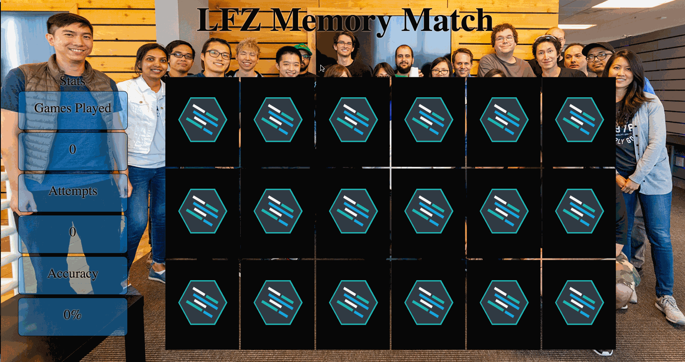

Instructions - Tracking Stats
--

### Overview

In this feature, you will now begin working with all the cards to introduce stats such as: `matches`, `accuracy`, and `games_played`. Additionally, you will be accurately displaying them as the user plays the game.

### Feature Set

1. In your `index.html`, uncomment all the cards. You should now have a total of 18 cards displayed on the page.
    - Make sure that you add the needed background images and to all of the child divs as you did in the previous feature sets
    - Also, make sure that you have two of each instructor!
2. In your `script.js`, begin by introducing the following variables into the same global space as the previous variables you declared:
   - `attempts`
   - `games_played`
3. Modify your existing `handleCardClick` function.
    - `attempts` should be incremented by `1` every time the player attempts to match 2 cards
    - When the player wins the game, increment the value of the `games_played` variable by `1`
4. Declare a function `calculateAccuracy`
    - This function will be used to calculate the players accuracy using the global `attempts` and `matches` variables you declared earlier
    - This function will be called from the next function you create, `displayStats`
5. Now, declare a function, `displayStats`.
    - This function will select the appropriate child elements inside of the `<aside>` and change the text to reflect the values inside of the our stats variables:
      - `attempts`
      - `accuracy`
      - `games_played`
    - To correctly update `accuracy`
      - Declare a variable in the `displayStats` function and store the result of calling `calculateAverage` function you created in the previous step
      - Use the value returned from the `calculateAverage` function to update the text in the proper `aside` child element

### Design Docs

#### Stats Tracking

### After Each Feature

- When your feature implementation is complete, you will want to save and submit your work to the branch that you have created.
  - Use `git status` to check that you are on the correct branch that represents your feature.
  - You will want to **add**, **commit**, and **push** the code that you have written to the appropriate Github repository.
    1. `git add .`
    2. `git commit -m "Description of the feature that you have implemented"`
       - e.g. `git commit -m "Added simple HTML skeleton"`
    3. `git push origin FEATURE_NAME_HERE`
       - e.g. `git push origin skeleton`

- Finally, you will want to create a pull request. This will merge the code from your newly **completed** feature branch into your `master` branch.

  1. Navigate to <kbd>New Pull Request</kbd>:
  
  2. Compare changes to merge:
  
  3. Create a new pull request:
  
  4. Merge pull request:
  
  5. Update master with the new changes:
  
  6. Go back to [Features](../../README.md#features), if you're still working through the project.
