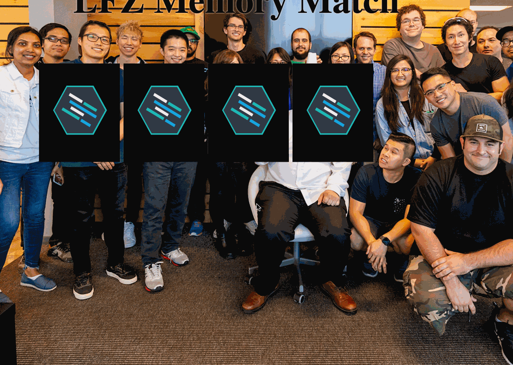

Instructions - Win Condition
--

### Overview

In this feature, a fourth card will be used to complete the base functionality of this project to "win" the game. We will be accomplishing this by matching two pairs of cards and displaying a modal.

   
What is a modal?

      A <a href="https://www.w3schools.com/howto/howto_css_modals.asp" target="_blank">modal</a> is a dialog bopopup window that is displayed on top of the current page.

### Feature Set

1. In your `index.html`, uncomment another card.
    - Add the proper background images to the child divs
    - There should now be a total of four cards displayed on the page.
2. In your `script.js`, declare another variable in the same global space as the previous variables:
    - `max_matches`
    - Set the of the `max_matches` value to the number 2
3. After each successful match of the two cards you have clicked:
    - check if your `matches` variable is equal to the `max_matches` variable
      - If true, display the modal to verify that there is a "win". This will now complete the game.
    - If false, nothing happens, the user will continue playing the game.

### Design Docs

#### Win Condition with Modal

### After Each Feature

- When your feature implementation is complete, you will want to save and submit your work to the branch that you have created.
  - Use `git status` to check that you are on the correct branch that represents your feature.
  - You will want to **add**, **commit**, and **push** the code that you have written to the appropriate Github repository.
    1. `git add .`
    2. `git commit -m "Description of the feature that you have implemented"`
       - e.g. `git commit -m "Added simple HTML skeleton"`
    3. `git push origin FEATURE_NAME_HERE`
       - e.g. `git push origin skeleton`

- Finally, you will want to create a pull request. This will merge the code from your newly **completed** feature branch into your `master` branch.

  1. Navigate to <kbd>New Pull Request</kbd>:
  
  2. Compare changes to merge:
  
  3. Create a new pull request:
  
  4. Merge pull request:
  
  5. Update master with the new changes:
  
  6. Go back to [Features](../../README.md#features), if you're still working through the project.
