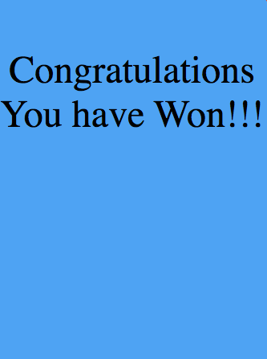
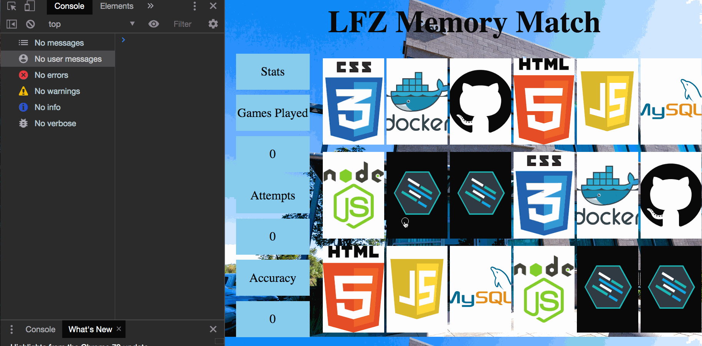

Instructions - User Can Win Game
--

### Overview

In this feature, you will build the functionality for the player to be able to `win` the game by matching all of the cards.

Let's take a look at the steps required to finish this Feature

1. Create global variables to keep track of the number of matches
2. Create the functionality to track the number of matches the user makes.
3. Create the functionality for the win condition to occur.
4. Build a modal which will inform the user when they have won.
5. Add JavaScript functionality to show the modal when the user wins.

So now that we have a list of tasks to complete, let's get started!

## 1. Create global variables to keep track of the number of matches

- The first thing you will need to create win condition functionality is a way to track how many matches have occured in the game.

- In order to start tracking matches, you will need 2 more global variables.
    - maxMatches
        - This variable will be used to contain a value which represents the amount of matches required to win the game.
            - For 18 cards, the total possible matches is 9.
    - matches
        - This variable will be used to track the amount of matches the user has completed during the game.
            - It will initially be assigned a value of 0.
- Declare the variables above with the proper initial values.
- When the above is complete, move on to the next step!

## 2. Create the functionality to track the number of matches the user makes.

- Now that you have a variable which contains the value for the maximum number of possible matches, and a variable which will be used to store the number of matches the user completes while playing the game, it is time to add functionality which will properly track the amount of matches made by the user.

- The first thing to figure out is `WHEN` you will have to `increment` the `matches` variable during the game.
    - This is an important part of developing logic.
    - In this game, you need to `increment` the `matches` variable every time the user matches two cards.
    - Within the above information in mind:
        - Find the conditional code block within the `handleClick` function which runs when the two selected cards match.
        - Within the correct code block:
            - `increment` the `matches` variable by 1.
    - Test your code by adding a console log of the `matches` variable after you `increment` it.
    - Example functionality:
    
    - When you have confirmed that the `matches` variable is being `incremented` when the cards match, and does not `increment` when they do not match, move on to the next step!

## 3. Create the functionality for the win condition to occur.

- Now that the `matches` variable is being properly incremented, it is time to add the functionality to inform the user when they win the game.

- This will be done by having the application check if the value of the `matches` variable is equal to the value of the `maxMatches` variable.
    - To complete this functionality:
        - create an `if` conditional statement directly after you `increment` the `matches` variable which checks if the values of the `maxMatches` and `matches` variable are equal.
            - If they are `equal`:
                - console log "you have won!"
    - When the above is completed, test your code!
    - Exmaple completed functionality:
    
    - When your code is properly informing the user of a win when all the cards are matched, move on to the next step!

## 4. Build a modal which will inform the user when they have won.

- So now that the game is properly tracking when the user wins, it is time to create a modal which will appear when the user wins to congratulate them.

- Let's take a moment to discuss what a modal is.
    - First, do not confuse a `bootstrap` modal with a modal more generally!
        - A `bootstrap` modal is a very specific HTML structure that is designed to work with the `bootstrap` library. It also requires the use of `jQuery` and other JavaScript code.
    - A `modal` is simply an element which shows up on the screen to either inform the user of something happening, such as when they win a game, or when the user has to input information for the application, like when a form pops up so that a user can log in on a membership website.
        - It is also recommended to make modals `position:fixed` so that when they appear on the screen, they do not affect the flow of the document and move other elements.
        - Fixed positioning also makes it so that the user cannot escape your modal.
            - I'm sure you have experienced this on many websites when a modal appears and you cannot scroll past it.
- So with the understanding that a modal is just a hidden element, usually with fixed positioning, note this example:

- The above is a simple but effective modal.
- So with the above information in mind, create a modal in HTML which is a sibling element to the `container` element, and style it with some CSS.
    - Once you have completed the design of the modal, make sure you add the `hidden` class to it so that it does not show up on the screen when the app loads.
- When you have completed the above and your modal is hidden and ready to excite the user, move on to the next step!

## 5. Add JavaScript functionality to show the modal when the user wins.

- Now that you have a completed modal which is hidden using the `hidden` class, it is time to add JavaScript functionality which will unhide the modal when the user wins the game.
    - Delete the "you have won!" console log.
    - Replace it with JavaScript code which will remove the `hidden` class from the modal when the user matches all of the cards.
    - Example Functionality:
    

    - When the above is complete and your modal shows correctly when all the cards are matched, Congratulations! you have completed this Feature!
    - Move on to the `After Each Feature` section.

### After Each Feature

- When your feature implementation is complete, you will want to save and submit your work to the branch that you have created.
  - Use `git status` to check that you are on the correct branch that represents your feature.
  - You will want to **add**, **commit**, and **push** the code that you have written to the appropriate Github repository.
    1. `git add .`
    2. `git commit -m "Description of the feature that you have implemented"`
       - e.g. `git commit -m "Added simple HTML skeleton"`
    3. `git push origin FEATURE_NAME_HERE`
       - e.g. `git push origin skeleton`

- Finally, you will want to create a pull request. This will merge the code from your newly **completed** feature branch into your `master` branch.

  1. Navigate to <kbd>New Pull Request</kbd>:
  
  2. Compare changes to merge:
  
  3. Create a new pull request:
  
  4. Merge pull request:
  
  5. Update master with the new changes:
  
  6. Create a pull request from your updated master branch to the student-reviews branch and send the pull request to your lead instructor in Slack.

  7. Go back to [Features](../../README.md#features), if you're still working through the project.
